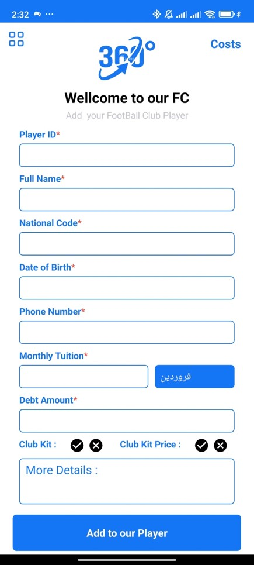
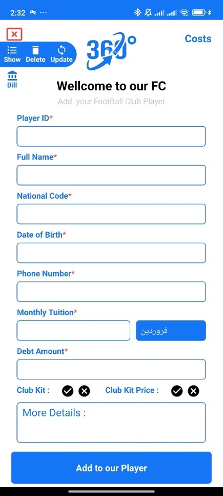
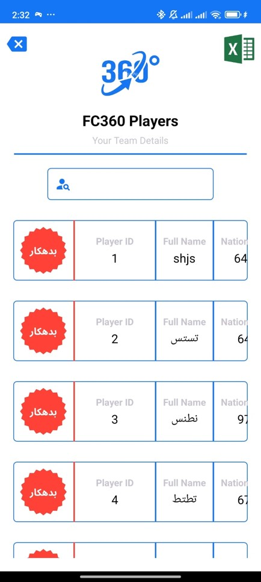
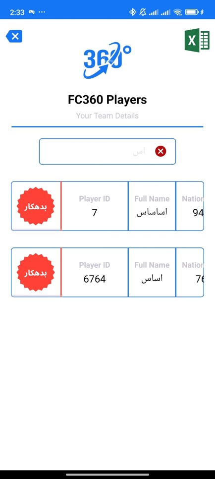
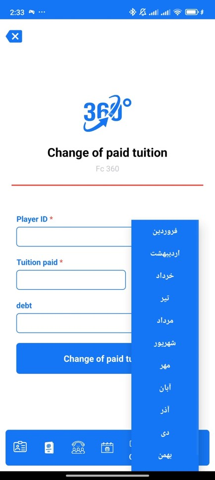
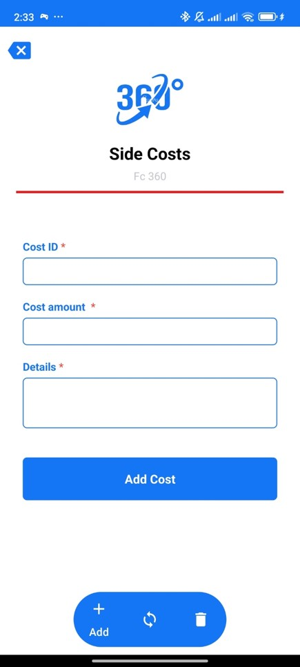
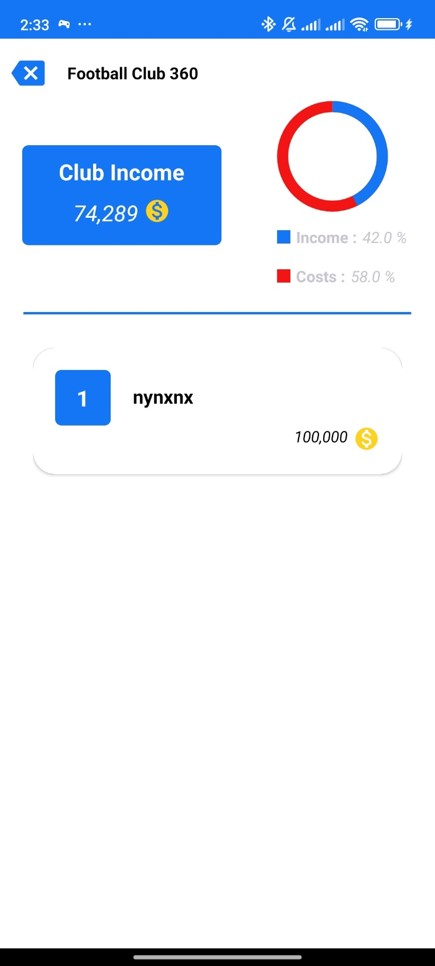

# ⚽ Football Club Manager – Android App

An intuitive and lightweight Android application developed in **Java** using **Android Studio**, designed to help football clubs easily manage player data, finances, and overall club statistics in a simple and practical interface.

---

## 📋 Features

- Add, update, and view player information
- Track incomes and expenses of the club
- Visualize overall financial and performance statistics
- Built with a focus on clean UI and user experience
- Entirely offline and easy to use

---

## 🛠 Tech Stack

- Java (Logic & Backend)
- Android Studio
- XML (UI Design)

---

## 📸 Screenshots

  
  
  
  
  
  
  
  

> Screenshots are for demo purposes – the source code is private.

---

## 🚧 Status

This app is complete and functional. Future enhancements may include chart visualizations, backup/export functionality, and multi-device syncing.
